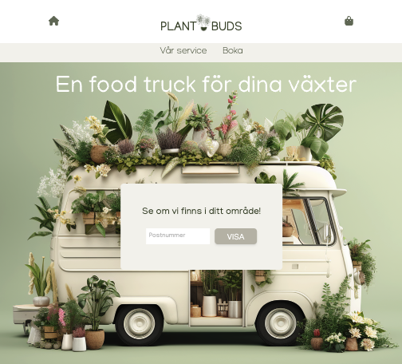
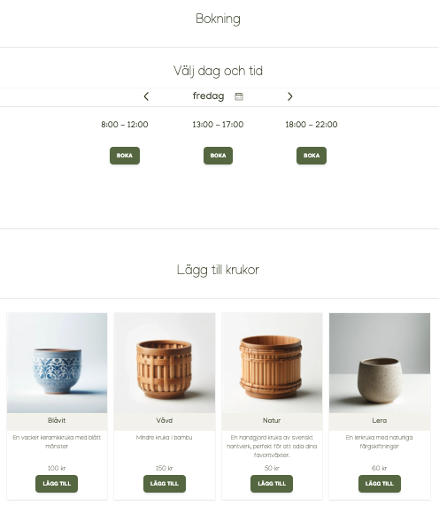
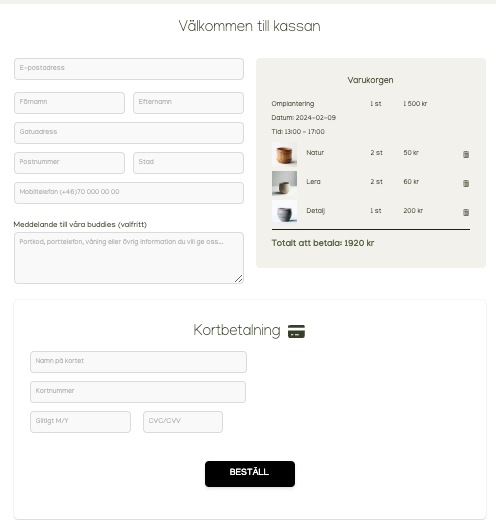

# Welcome to PlantBuds

## Project description

Plant Buds is a fictive company offering a unique replanting service on their platform. Users can schedule a session for their house plants, where Plant Buds will bring a mobile service bus equipped with soil and pots to perform the replanting at the customer's home. The service can connect to a plant store, for easy providings of supplies and the option to sell and deliver new plants and pots in various price ranges on the replanting day.

In this application you can check your postal number and if you are located in the Stockholm area, we can deliver! You can book a date and a time-slot for the buddies to come and add some new pots. Checkout will create an order and give you verification on the screen.

## How to install and run the project

### Prerequisities

- Node.js > 18
- npm
- Docker

Install project dependencies

```
npm install
```

Start database

```
docker compose -f ./postgres/compose.yaml up

```

Run application in dev

```
npm run dev

```

To connect to the database with a psql shell you can use the attach command

```
bash ./postgres/attach.sh

```

application found at localhost:3000






